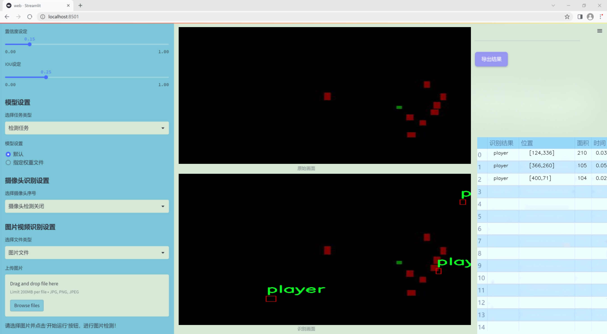
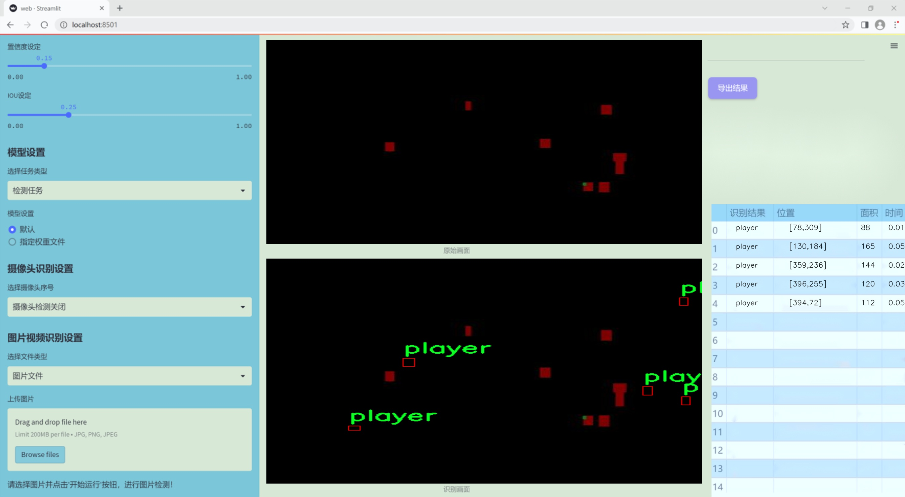
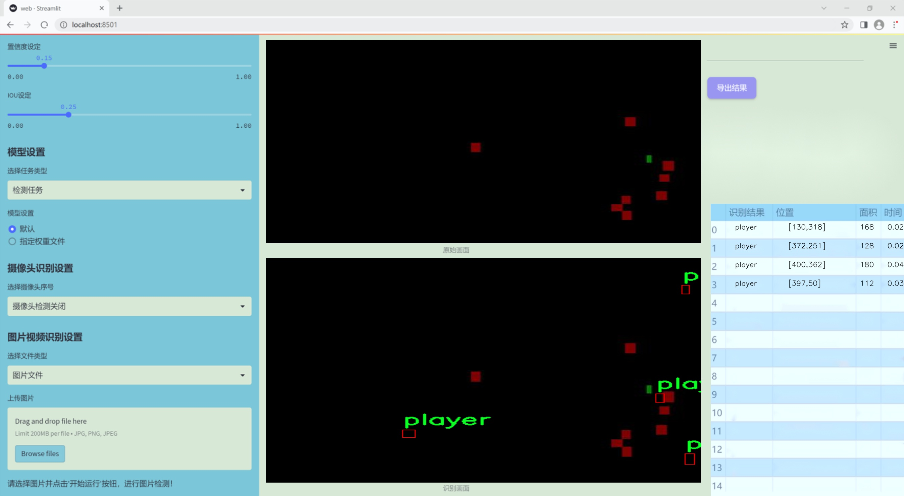
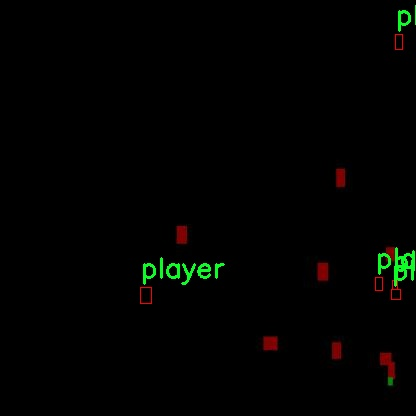
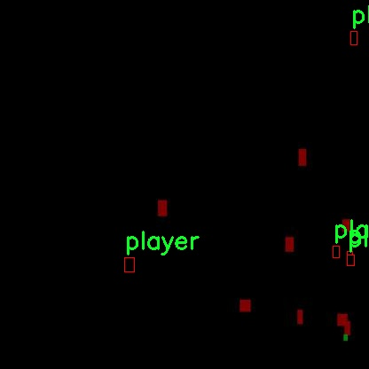
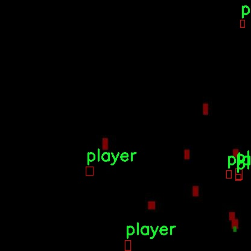
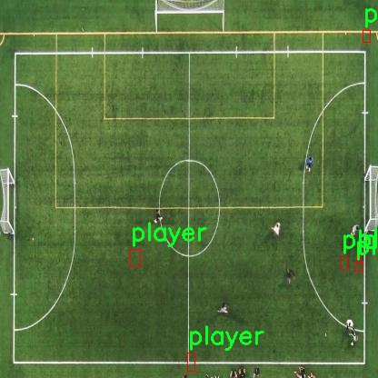
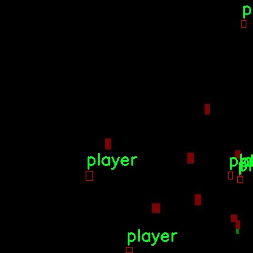

# 改进yolo11-TADDH等200+全套创新点大全：足球比赛分析系统源码＆数据集全套

### 1.图片效果展示







##### 项目来源 **[人工智能促进会 2024.10.30](https://kdocs.cn/l/cszuIiCKVNis)**

注意：由于项目一直在更新迭代，上面“1.图片效果展示”和“2.视频效果展示”展示的系统图片或者视频可能为老版本，新版本在老版本的基础上升级如下：（实际效果以升级的新版本为准）

  （1）适配了YOLOV11的“目标检测”模型和“实例分割”模型，通过加载相应的权重（.pt）文件即可自适应加载模型。

  （2）支持“图片识别”、“视频识别”、“摄像头实时识别”三种识别模式。

  （3）支持“图片识别”、“视频识别”、“摄像头实时识别”三种识别结果保存导出，解决手动导出（容易卡顿出现爆内存）存在的问题，识别完自动保存结果并导出到tempDir中。

  （4）支持Web前端系统中的标题、背景图等自定义修改。

  另外本项目提供训练的数据集和训练教程,暂不提供权重文件（best.pt）,需要您按照教程进行训练后实现图片演示和Web前端界面演示的效果。

### 2.视频效果展示

[2.1 视频效果展示](https://www.bilibili.com/video/BV1ibSeYRE6A/)

### 3.背景

研究背景与意义

随着足球运动的全球普及和竞技水平的不断提高，如何有效分析比赛过程中的关键要素，提升球队的战术决策能力，成为了体育科学研究的重要课题。传统的比赛分析方法往往依赖于人工观察和记录，效率低下且容易受到主观因素的影响。近年来，计算机视觉技术的快速发展为体育分析提供了新的解决方案，尤其是目标检测算法的应用，使得自动化分析成为可能。在此背景下，基于改进YOLOv11的足球比赛分析系统应运而生。

YOLO（You Only Look Once）系列算法因其高效的实时目标检测能力而受到广泛关注。YOLOv11作为该系列的最新版本，结合了深度学习的先进技术，能够在复杂场景中快速准确地识别和定位目标。针对足球比赛的特点，本研究将利用YOLOv11对比赛中的球员和足球进行实时检测，从而为教练和分析师提供更为精确的数据支持。我们所使用的数据集包含1300张图像，涵盖了球员和足球这两个主要类别，能够为模型的训练和测试提供丰富的样本。

通过改进YOLOv11的网络结构和训练策略，我们期望提升模型在不同场景下的检测精度和速度，以适应快速变化的比赛环境。此外，本系统的开发不仅有助于提升比赛分析的自动化水平，还能为球队提供数据驱动的战术建议，帮助教练团队制定更为科学的训练和比赛策略。因此，基于改进YOLOv11的足球比赛分析系统的研究，具有重要的理论价值和实际应用意义，将为足球运动的智能化发展贡献一份力量。

### 4.数据集信息展示

##### 4.1 本项目数据集详细数据（类别数＆类别名）

nc: 2
names: ['ball', 'player']


该项目为【目标检测】数据集，请在【训练教程和Web端加载模型教程（第三步）】这一步的时候按照【目标检测】部分的教程来训练

##### 4.2 本项目数据集信息介绍

本项目数据集信息介绍

本项目所使用的数据集名为“Football_analytics”，旨在为改进YOLOv11的足球比赛分析系统提供支持。该数据集专注于足球比赛中的关键元素，具体包含两类对象：足球（ball）和球员（player）。数据集的类别数量为2，涵盖了足球比赛中最为重要的两个组成部分，这为系统的训练和测试提供了丰富的基础。

“Football_analytics”数据集经过精心标注，确保每个图像中的球和球员都被准确识别和分类。这种精确的标注不仅提高了模型的训练效率，也为后续的分析和应用提供了可靠的数据基础。数据集中的图像来源于不同的比赛场景，涵盖了多种光照条件、角度和距离，确保模型能够在各种实际情况下进行有效的识别和分析。

通过使用“Football_analytics”数据集，改进后的YOLOv11模型将能够更好地理解足球比赛中的动态场景，识别球员的运动轨迹以及足球的实时位置。这对于战术分析、比赛回放以及实时监控等应用场景具有重要意义。此外，数据集的设计考虑到了足球比赛的复杂性，使得模型在处理不同战术风格和比赛节奏时，能够展现出更高的鲁棒性和准确性。

总之，“Football_analytics”数据集为本项目提供了坚实的数据基础，使得改进YOLOv11的足球比赛分析系统能够在准确性和效率上达到新的高度，推动足球比赛分析技术的发展。











### 5.全套项目环境部署视频教程（零基础手把手教学）

[5.1 所需软件PyCharm和Anaconda安装教程（第一步）](https://www.bilibili.com/video/BV1BoC1YCEKi/?spm_id_from=333.999.0.0&vd_source=bc9aec86d164b67a7004b996143742dc)


[5.2 安装Python虚拟环境创建和依赖库安装视频教程（第二步）](https://www.bilibili.com/video/BV1ZoC1YCEBw?spm_id_from=333.788.videopod.sections&vd_source=bc9aec86d164b67a7004b996143742dc)

### 6.改进YOLOv11训练教程和Web_UI前端加载模型教程（零基础手把手教学）

[6.1 改进YOLOv11训练教程和Web_UI前端加载模型教程（第三步）](https://www.bilibili.com/video/BV1BoC1YCEhR?spm_id_from=333.788.videopod.sections&vd_source=bc9aec86d164b67a7004b996143742dc)


按照上面的训练视频教程链接加载项目提供的数据集，运行train.py即可开始训练



     Epoch   gpu_mem       box       obj       cls    labels  img_size
     1/200     20.8G   0.01576   0.01955  0.007536        22      1280: 100%|██████████| 849/849 [14:42<00:00,  1.04s/it]
               Class     Images     Labels          P          R     mAP@.5 mAP@.5:.95: 100%|██████████| 213/213 [01:14<00:00,  2.87it/s]
                 all       3395      17314      0.994      0.957      0.0957      0.0843

     Epoch   gpu_mem       box       obj       cls    labels  img_size
     2/200     20.8G   0.01578   0.01923  0.007006        22      1280: 100%|██████████| 849/849 [14:44<00:00,  1.04s/it]
               Class     Images     Labels          P          R     mAP@.5 mAP@.5:.95: 100%|██████████| 213/213 [01:12<00:00,  2.95it/s]
                 all       3395      17314      0.996      0.956      0.0957      0.0845

     Epoch   gpu_mem       box       obj       cls    labels  img_size
     3/200     20.8G   0.01561    0.0191  0.006895        27      1280: 100%|██████████| 849/849 [10:56<00:00,  1.29it/s]
               Class     Images     Labels          P          R     mAP@.5 mAP@.5:.95: 100%|███████   | 187/213 [00:52<00:00,  4.04it/s]
                 all       3395      17314      0.996      0.957      0.0957      0.0845


###### [项目数据集下载链接](https://kdocs.cn/l/cszuIiCKVNis)

### 7.原始YOLOv11算法讲解


##### YOLO11介绍

Ultralytics YOLO11是一款尖端的、最先进的模型，它在之前YOLO版本成功的基础上进行了构建，并引入了新功能和改进，以进一步提升性能和灵活性。
**YOLO11设计快速、准确且易于使用，使其成为各种物体检测和跟踪、实例分割、图像分类以及姿态估计任务的绝佳选择。**


**结构图如下：**


##### **C3k2**

**C3k2，结构图如下**


**C3k2，继承自类`C2f，其中通过c3k设置False或者Ture来决定选择使用C3k还是`**Bottleneck


**实现代码** **ultralytics/nn/modules/block.py**

##### C2PSA介绍

**借鉴V10 PSA结构，实现了C2PSA和C2fPSA，最终选择了基于C2的C2PSA（可能涨点更好？）**


**实现代码** **ultralytics/nn/modules/block.py**

##### Detect介绍

**分类检测头引入了DWConv（更加轻量级，为后续二次创新提供了改进点），结构图如下（和V8的区别）：**


### 8.200+种全套改进YOLOV11创新点原理讲解

#### 8.1 200+种全套改进YOLOV11创新点原理讲解大全

由于篇幅限制，每个创新点的具体原理讲解就不全部展开，具体见下列网址中的改进模块对应项目的技术原理博客网址【Blog】（创新点均为模块化搭建，原理适配YOLOv5~YOLOv11等各种版本）

[改进模块技术原理博客【Blog】网址链接](https://gitee.com/qunmasj/good)


#### 8.2 精选部分改进YOLOV11创新点原理讲解

###### 这里节选部分改进创新点展开原理讲解(完整的改进原理见上图和[改进模块技术原理博客链接](https://gitee.com/qunmasj/good)【如果此小节的图加载失败可以通过CSDN或者Github搜索该博客的标题访问原始博客，原始博客图片显示正常】


### D-LKA Attention简介
自2010年代中期以来，卷积神经网络（CNNs）已成为许多计算机视觉应用的首选技术。它们能够从原始数据中自动提取复杂的特征表示，无需手动进行特征工程，这引起了医学图像分析社区的极大兴趣。许多成功的CNN架构，如U-Net、全卷积网络、DeepLab或SegCaps（分割胶囊），已经被开发出来。这些架构在语义分割任务中取得了巨大成功，先前的最新方法已经被超越。

在计算机视觉研究中，不同尺度下的目标识别是一个关键问题。在CNN中，可检测目标的大小与相应网络层的感受野尺寸密切相关。如果一个目标扩展到超出这个感受野的边界，这可能会导致欠分割结果。相反，与目标实际大小相比使用过大的感受野可能会限制识别，因为背景信息可能会对预测产生不必要的影响。

解决这个问题的一个有希望的方法涉及在并行使用具有不同尺寸的多个Kernel，类似于Inception块的机制。然而，由于参数和计算要求的指数增长，将Kernel大小增加以容纳更大的目标在实践中受到限制。因此，出现了各种策略，包括金字塔池化技术和不同尺度的扩张卷积，以捕获多尺度的上下文信息。

另一个直观的概念涉及将多尺度图像金字塔或它们的相关特征表示直接纳入网络架构。然而，这种方法存在挑战，特别是在管理训练和推理时间方面的可行性方面存在挑战。在这个背景下，使用编码器-解码器网络，如U-Net，已被证明是有利的。这样的网络在较浅的层中编码外观和位置，而在更深的层中，通过神经元的更广泛的感受野捕获更高的语义信息和上下文信息。

一些方法将来自不同层的特征组合在一起，或者预测来自不同尺寸的层的特征以使用多尺度的信息。此外，出现了从不同尺度的层中预测特征的方法，有效地实现了跨多个尺度的见解整合。然而，大多数编码器-解码器结构面临一个挑战：它们经常无法在不同尺度之间保持一致的特征，并主要使用最后一个解码器层生成分割结果。

语义分割是一项任务，涉及根据预定义的标签集为图像中的每个像素预测语义类别。这项任务要求提取高级特征同时保留初始的空间分辨率。CNNs非常适合捕获局部细节和低级信息，尽管以忽略全局上下文为代价。视觉Transformer（ViT）架构已经成为解决处理全局信息的视觉任务的关键，包括语义分割，取得了显著的成功。

ViT的基础是注意力机制，它有助于在整个输入序列上聚合信息。这种能力使网络能够合并远程的上下文提示，超越了CNN的有限感受野尺寸。然而，这种策略通常会限制ViT有效建模局部信息的能力。这种局限可能会妨碍它们检测局部纹理的能力，这对于各种诊断和预测任务至关重要。这种缺乏局部表示可以归因于ViT模型处理图像的特定方式。

ViT模型将图像分成一系列Patch，并使用自注意力机制来模拟它们之间的依赖关系。这种方法可能不如CNN模型中的卷积操作对感受野内提取局部特征有效。ViT和CNN模型之间的这种图像处理方法的差异可能解释了CNN模型在局部特征提取方面表现出色的原因。

近年来，已经开发出创新性方法来解决Transformer模型内部局部纹理不足的问题。其中一种方法是通过互补方法将CNN和ViT特征结合起来，以结合它们的优势并减轻局部表示的不足。TransUNet是这种方法的早期示例，它在CNN的瓶颈中集成了Transformer层，以模拟局部和全局依赖关系。HiFormer提出了一种解决方案，将Swin Transformer模块和基于CNN的编码器结合起来，生成两个多尺度特征表示，通过Double-Level Fusion模块集成。UNETR使用基于Transformer的编码器和CNN解码器进行3D医学图像分割。CoTr和TransBTS通过Transformer在低分辨率阶段增强分割性能，将CNN编码器和解码器连接在一起。

增强局部特征表示的另一种策略是重新设计纯Transformer模型内部的自注意力机制。在这方面，Swin-Unet在U形结构中集成了一个具有线性计算复杂性的Swin Transformer块作为多尺度 Backbone 。MISSFormer采用高效Transformer来解决视觉Transformer中的参数问题，通过在输入块上进行不可逆的降采样操作。D-Former引入了一个纯Transformer的管道，具有双重注意模块，以分段的方式捕获细粒度的局部注意和与多元单元的交互。然而，仍然存在一些特定的限制，包括计算效率低下，如TransUNet模型所示，对CNN Backbone 的严重依赖，如HiFormer所观察到的，以及对多尺度信息的忽略。

此外，目前的分割架构通常采用逐层处理3D输入 volumetric 的方法，无意中忽视了相邻切片之间的潜在相关性。这一疏忽限制了对 volumetric 信息的全面利用，因此损害了定位精度和上下文集成。此外，必须认识到，医学领域的病变通常在形状上发生变形。因此，用于医学图像分析的任何学习算法都必须具备捕捉和理解这些变形的能力。与此同时，该算法应保持计算效率，以便处理3D volumetric数据。

为了解决上述提到的挑战，作者提出了一个解决方案，即可变形大卷积核注意力模块（Deformable LKA module），它是作者网络设计的基本构建模块。这个模块明确设计成在有效处理上下文信息的同时保留局部描述符。作者的架构在这两个方面的平衡增强了实现精确语义分割的能力。

值得注意的是，参考该博客引入了一种基于数据的感受野的动态适应，不同于传统卷积操作中的固定滤波器Mask。这种自适应方法使作者能够克服与静态方法相关的固有限制。这种创新方法还扩展到了D-LKA Net架构的2D和3D版本的开发。

在3D模型的情况下，D-LKA机制被量身定制以适应3D环境，从而实现在不同 volumetric 切片之间无缝信息交互。最后，作者的贡献通过其计算效率得到进一步强调。作者通过仅依靠D-LKA概念的设计来实现这一点，在各种分割基准上取得了显著的性能，确立了作者的方法作为一种新的SOTA方法。

在本节中，作者首先概述方法论。首先，作者回顾了由Guo等人引入的大卷积核注意力（Large Kernel Attention，LKA）的概念。然后，作者介绍了作者对可变形LKA模块的创新探索。在此基础上，作者介绍了用于分割任务的2D和3D网络架构。

大卷积核提供了与自注意力机制类似的感受野。可以通过使用深度卷积、深度可扩展卷积和卷积来构建大卷积核，从而减少了参数和计算量。构建输入维度为和通道数的卷积核的深度卷积和深度可扩展卷积的卷积核大小的方程如下：


具有卷积核大小和膨胀率。参数数量和浮点运算（FLOPs）的计算如下：


FLOPs的数量与输入图像的大小成线性增长。参数的数量随通道数和卷积核大小的增加而呈二次增长。然而，由于它们通常都很小，因此它们不是限制因素。

为了最小化对于固定卷积核大小K的参数数量，可以将方程3对于膨胀率的导数设定为零：


例如，当卷积核大小为时，结果是。将这些公式扩展到3D情况是直接的。对于大小为和通道数C的输入，3D情况下参数数量和FLOPs 的方程如下：


具有卷积核大小和膨胀。


利用大卷积核进行医学图像分割的概念通过引入可变形卷积得以扩展。可变形卷积可以通过整数偏移自由调整采样网格以进行自由变形。额外的卷积层从特征图中学习出变形，从而创建一个偏移场。基于特征本身学习变形会导致自适应卷积核。这种灵活的卷积核形状可以提高病变或器官变形的表示，从而增强了目标边界的定义。

负责计算偏移的卷积层遵循其相应卷积层的卷积核大小和膨胀。双线性插值用于计算不在图像网格上的偏移的像素值。如图2所示，D-LKA模块可以表示为：


其中输入特征由表示，。表示为注意力图，其中每个值表示相应特征的相对重要性。运算符  表示逐元素乘法运算。值得注意的是，LKA不同于传统的注意力方法，它不需要额外的规范化函数，如或。这些规范化函数往往忽视高频信息，从而降低了基于自注意力的方法的性能。

在该方法的2D版本中，卷积层被可变形卷积所替代，因为可变形卷积能够改善对具有不规则形状和大小的目标的捕捉能力。这些目标在医学图像数据中常常出现，因此这种增强尤为重要。

然而，将可变形LKA的概念扩展到3D领域会带来一定的挑战。主要的约束来自于需要用于生成偏移的额外卷积层。与2D情况不同，由于输入和输出通道的性质，这一层无法以深度可分的方式执行。在3D环境中，输入通道对应于特征，而输出通道扩展到，其中是卷积核的大小。大卷积核的复杂性导致沿第3D的通道数扩展，导致参数和FLOPs大幅增加。因此，针对3D情况采用了另一种替代方法。在现有的LKA框架中，深度卷积之后引入了一个单独的可变形卷积层。这种战略性的设计调整旨在减轻扩展到3D领域所带来的挑战。


2D网络的架构如图1所示。第一变种使用MaxViT作为编码器组件，用于高效特征提取，而第二变种则结合可变形LKA层进行更精细、卓越的分割。

在更正式的描述中，编码器生成4个分层输出表示。首先，卷积干扰将输入图像的维度减小到。随后，通过4个MaxViT块的4个阶段进行特征提取，每个阶段后跟随降采样层。随着过程进展到解码器，实施了4个阶段的D-LKA层，每个阶段包含2个D-LKA块。然后，应用Patch扩展层以实现分辨率上采样，同时减小通道维度。最后，线性层负责生成最终的输出。

2D D-LKA块的结构包括LayerNorm、可变形LKA和多层感知器（MLP）。积分残差连接确保了有效的特征传播，即使在更深层也是如此。这个安排可以用数学方式表示为：


其中输入特征，层归一化LN，可变形LKA注意力，深度卷积，线性层和GeLU激活函数。

3D网络架构如图1所示，采用编码器-解码器设计进行分层结构化。首先，一个Patch嵌入层将输入图像的维度从（）减小到（）。在编码器中，采用了3个D-LKA阶段的序列，每个阶段包含3个D-LKA块。在每个阶段之后，通过降采样步骤将空间分辨率减半，同时将通道维度加倍。中央瓶颈包括另一组2个D-LKA块。解码器结构与编码器相对称。

为了将特征分辨率加倍，同时减少通道数，使用转置卷积。每个解码器阶段都使用3个D-LKA块来促进远距离特征依赖性。最终的分割输出由一个卷积层产生，后面跟随一个卷积层以匹配特定类别的通道要求。

为了建立输入图像和分割输出之间的直接连接，使用卷积形成了一个跳跃连接。额外的跳跃连接根据简单的加法对来自其他阶段的特征进行融合。最终的分割图是通过和卷积层的组合产生的。

3D D-LKA块包括层归一化，后跟D-LKA注意力，应用了残差连接的部分。随后的部分采用了一个卷积层，后面跟随一个卷积层，两者都伴随着残差连接。这个整个过程可以总结如下：


带有输入特征 、层归一化 、可变形 LKA 、卷积层 和输出特征 的公式。是指一个前馈网络，包括2个卷积层和激活函数。

表7显示了普通卷积和构建卷积的参数数量比较。尽管标准卷积的参数数量在通道数较多时急剧增加，但分解卷积的参数总体较低，并且增长速度不那么快。

与分解卷积相比，可变形分解卷积增加了大量参数，但仍然明显小于标准卷积。可变形卷积的主要参数是由偏移网络创建的。在这里，作者假设可变形深度卷积的Kernel大小为（5,5），可变形深度空洞卷积的Kernel大小为（7,7）。这导致了21×21大小的大Kernel的最佳参数数量。更高效地生成偏移量的方法将大大减少参数数量。


值得注意的是，引入可变形LKA确实会增加模型的参数数量和每秒的浮点运算次数（FLOPS）。然而，重要的是强调，这增加的计算负载不会影响作者模型的整体推理速度。

相反，对于Batch-size > 1，作者甚至观察到推理时间的减少，如图7所示。例如，基于作者的广泛实验，作者观察到对于Batch-size为16，具有可变形卷积和没有可变形卷积的推理时间分别为8.01毫秒和17.38毫秒。作者认为这是由于在2D中对可变形卷积的高效实现所致。为了测量时间，使用了大小为（）的随机输入。在GPU热身周期50次迭代之后，网络被推断了1000次。测量是在NVIDIA RTX 3090 GPU上进行的。


为了充分利用性能与参数之间的权衡关系，作者在图8中可视化了在Synapse 2D数据集上报告的DSC和HD性能以及基于参数数量的内存消耗。D-LKA Net引入了相当多的参数，约为101M。这比性能第二好的方法ScaleFormer使用的111.6M参数要少。

与更轻量级的DAEFormer模型相比，作者实现了更好的性能，这证明了参数增加的合理性。大多数参数来自于MaxViT编码器；因此，将编码器替换为更高效的编码器可以减少模型参数。值得注意的是，在此可视化中，作者最初将HD和内存值都归一化到[0, 100]范围内。随后，作者将它们从100缩小，以增强更高值的表示。


### 9.系统功能展示

图9.1.系统支持检测结果表格显示

  图9.2.系统支持置信度和IOU阈值手动调节

  图9.3.系统支持自定义加载权重文件best.pt(需要你通过步骤5中训练获得)

  图9.4.系统支持摄像头实时识别

  图9.5.系统支持图片识别

  图9.6.系统支持视频识别

  图9.7.系统支持识别结果文件自动保存

  图9.8.系统支持Excel导出检测结果数据


### 10. YOLOv11核心改进源码讲解

#### 10.1 FreqFusion.py

以下是对代码中最核心部分的提取和详细注释。代码主要实现了一个频率感知特征融合的神经网络模块，用于密集图像预测。以下是精简后的代码和注释：

```python
import torch
import torch.nn as nn
import torch.nn.functional as F

class FreqFusion(nn.Module):
    def __init__(self, channels, scale_factor=1, lowpass_kernel=5, highpass_kernel=3):
        """
        初始化频率感知特征融合模块。

        参数：
        - channels: 输入特征的通道数，格式为 (高分辨率通道数, 低分辨率通道数)
        - scale_factor: 上采样因子
        - lowpass_kernel: 低通滤波器的卷积核大小
        - highpass_kernel: 高通滤波器的卷积核大小
        """
        super().__init__()
        hr_channels, lr_channels = channels
        self.scale_factor = scale_factor
        
        # 压缩高分辨率和低分辨率特征通道
        self.hr_channel_compressor = nn.Conv2d(hr_channels, hr_channels // 8, kernel_size=1)
        self.lr_channel_compressor = nn.Conv2d(lr_channels, lr_channels // 8, kernel_size=1)

        # 低通滤波器卷积层
        self.content_encoder = nn.Conv2d(
            hr_channels // 8,
            lowpass_kernel ** 2,
            kernel_size=3,
            padding=1
        )

        # 高通滤波器卷积层
        self.content_encoder2 = nn.Conv2d(
            hr_channels // 8,
            highpass_kernel ** 2,
            kernel_size=3,
            padding=1
        )

    def forward(self, x):
        """
        前向传播函数。

        参数：
        - x: 输入特征，格式为 (高分辨率特征, 低分辨率特征)

        返回：
        - 融合后的特征
        """
        hr_feat, lr_feat = x
        
        # 压缩特征
        compressed_hr_feat = self.hr_channel_compressor(hr_feat)
        compressed_lr_feat = self.lr_channel_compressor(lr_feat)

        # 计算低通和高通特征
        lowpass_feat = self.content_encoder(compressed_hr_feat)
        highpass_feat = self.content_encoder2(compressed_hr_feat)

        # 融合特征
        fused_feat = lowpass_feat + highpass_feat

        # 上采样低分辨率特征
        lr_feat_upsampled = F.interpolate(lr_feat, scale_factor=self.scale_factor, mode='bilinear', align_corners=False)

        # 返回融合后的特征
        return fused_feat + lr_feat_upsampled

# 示例使用
# channels = (高分辨率通道数, 低分辨率通道数)
# model = FreqFusion(channels=(64, 32))
# output = model((hr_input, lr_input))
```

### 代码说明
1. **类 `FreqFusion`**: 这是实现频率感知特征融合的核心类，继承自 `nn.Module`。
2. **初始化方法 `__init__`**:
   - 接收输入通道数、上采样因子、低通和高通卷积核大小。
   - 定义了高分辨率和低分辨率特征的压缩卷积层。
   - 定义了用于生成低通和高通特征的卷积层。
3. **前向传播方法 `forward`**:
   - 接收高分辨率和低分辨率特征。
   - 压缩特征通道数。
   - 计算低通和高通特征。
   - 将低通和高通特征相加，得到融合特征。
   - 对低分辨率特征进行上采样，并与融合特征相加，最终返回融合后的特征。

这个模块可以用于图像处理任务中，通过融合不同频率的特征来提高图像的预测精度。

该文件 `FreqFusion.py` 实现了一个名为 `FreqFusion` 的深度学习模块，主要用于密集图像预测中的频率感知特征融合。该模块结合了高通和低通滤波器的特性，以增强图像特征的表达能力，特别是在图像超分辨率等任务中。

首先，文件导入了必要的库，包括 PyTorch 和一些常用的神经网络模块。接着，定义了一些初始化函数，例如 `normal_init` 和 `constant_init`，用于初始化神经网络中的权重和偏置。

接下来，定义了一个 `resize` 函数，用于调整输入张量的大小，并在必要时发出警告。`hamming2D` 函数用于生成二维 Hamming 窗，主要用于后续的滤波操作。

`FreqFusion` 类是该文件的核心部分。在初始化方法中，类接受多个参数，包括通道数、缩放因子、低通和高通核的大小等。类内部定义了多个卷积层，用于对高分辨率和低分辨率特征进行压缩和编码。还包括一些用于特征重采样的选项，如 `feature_resample` 和 `comp_feat_upsample`。

在 `init_weights` 方法中，所有卷积层的权重被初始化为 Xavier 分布或正态分布，以确保网络的良好收敛性。

`kernel_normalizer` 方法用于对生成的掩码进行归一化处理，确保其和为1，以便在后续的卷积操作中使用。

`forward` 方法是模块的前向传播逻辑，接受高分辨率和低分辨率特征作为输入。根据不同的配置，模块会使用高通和低通滤波器来处理特征，并结合不同的卷积操作生成最终的输出特征。

在 `_forward` 方法中，具体实现了特征的压缩、掩码的生成以及特征的融合。该方法还考虑了是否使用半卷积（`semi_conv`）以及是否进行特征重采样（`feature_resample`）。通过使用 CARAFE（Content-Aware ReAssembly of FEatures）操作，模块能够有效地对特征进行上采样和融合。

`LocalSimGuidedSampler` 类实现了一个偏移生成器，用于在特征重采样过程中生成局部相似性引导的偏移量。该类包含了计算相似性的逻辑，并在前向传播中使用这些偏移量对特征进行采样。

最后，`compute_similarity` 函数用于计算输入张量中每个点与其周围点的余弦相似度，以帮助生成更为精确的特征重采样。

整体来看，该文件实现了一个复杂的频率感知特征融合模块，能够有效地处理图像特征并提高图像预测的精度，适用于图像超分辨率等任务。

#### 10.2 shiftwise_conv.py

以下是代码中最核心的部分，并附上详细的中文注释：

```python
import math
import torch
import torch.nn as nn
import torch.nn.functional as F

def get_conv2d(in_channels, out_channels, kernel_size, stride, padding, dilation, groups, bias):
    """
    创建一个2D卷积层
    """
    return nn.Conv2d(
        in_channels, out_channels, kernel_size, stride, padding, dilation, groups, bias
    )

def get_bn(channels):
    """
    创建一个批归一化层
    """
    return nn.BatchNorm2d(channels)

class Mask(nn.Module):
    """
    定义一个Mask类，用于生成可学习的权重掩码
    """
    def __init__(self, size):
        super().__init__()
        # 初始化权重参数，范围在-1到1之间
        self.weight = torch.nn.Parameter(data=torch.Tensor(*size), requires_grad=True)
        self.weight.data.uniform_(-1, 1)

    def forward(self, x):
        # 使用sigmoid函数对权重进行归一化
        w = torch.sigmoid(self.weight)
        # 将输入x与权重w相乘，得到掩码后的输出
        masked_wt = w.mul(x)
        return masked_wt

class ReparamLargeKernelConv(nn.Module):
    """
    定义一个重参数化的大卷积核类
    """
    def __init__(self, in_channels, out_channels, kernel_size, small_kernel=5, stride=1, groups=1, small_kernel_merged=False, Decom=True, bn=True):
        super(ReparamLargeKernelConv, self).__init__()
        self.kernel_size = kernel_size
        self.small_kernel = small_kernel
        self.Decom = Decom
        padding = kernel_size // 2  # 假设卷积不会改变特征图的大小，设置padding为kernel_size的一半

        # 根据是否合并小卷积核，选择不同的卷积结构
        if small_kernel_merged:
            self.lkb_reparam = get_conv2d(
                in_channels=in_channels,
                out_channels=out_channels,
                kernel_size=kernel_size,
                stride=stride,
                padding=padding,
                dilation=1,
                groups=groups,
                bias=True,
            )
        else:
            if self.Decom:
                self.LoRA = conv_bn(
                    in_channels=in_channels,
                    out_channels=out_channels,
                    kernel_size=(kernel_size, small_kernel),
                    stride=stride,
                    padding=padding,
                    dilation=1,
                    groups=groups,
                    bn=bn
                )
            else:
                self.lkb_origin = conv_bn(
                    in_channels=in_channels,
                    out_channels=out_channels,
                    kernel_size=kernel_size,
                    stride=stride,
                    padding=padding,
                    dilation=1,
                    groups=groups,
                    bn=bn,
                )

            if (small_kernel is not None) and small_kernel < kernel_size:
                self.small_conv = conv_bn(
                    in_channels=in_channels,
                    out_channels=out_channels,
                    kernel_size=small_kernel,
                    stride=stride,
                    padding=small_kernel // 2,
                    groups=groups,
                    dilation=1,
                    bn=bn,
                )
        
        self.bn = get_bn(out_channels)  # 创建批归一化层
        self.act = nn.SiLU()  # 使用SiLU激活函数

    def forward(self, inputs):
        """
        前向传播函数
        """
        if hasattr(self, "lkb_reparam"):
            out = self.lkb_reparam(inputs)  # 使用重参数化的卷积
        elif self.Decom:
            out = self.LoRA(inputs)  # 使用LoRA结构
            if hasattr(self, "small_conv"):
                out += self.small_conv(inputs)  # 加上小卷积的输出
        else:
            out = self.lkb_origin(inputs)  # 使用原始卷积
            if hasattr(self, "small_conv"):
                out += self.small_conv(inputs)  # 加上小卷积的输出
        return self.act(self.bn(out))  # 返回经过激活和归一化的输出

    def get_equivalent_kernel_bias(self):
        """
        获取等效的卷积核和偏置
        """
        eq_k, eq_b = fuse_bn(self.lkb_origin.conv, self.lkb_origin.bn)  # 融合卷积和批归一化
        if hasattr(self, "small_conv"):
            small_k, small_b = fuse_bn(self.small_conv.conv, self.small_conv.bn)
            eq_b += small_b  # 更新偏置
            eq_k += nn.functional.pad(small_k, [(self.kernel_size - self.small_kernel) // 2] * 4)  # 对小卷积核进行填充
        return eq_k, eq_b

    def switch_to_deploy(self):
        """
        切换到部署模式
        """
        if hasattr(self, 'lkb_origin'):
            eq_k, eq_b = self.get_equivalent_kernel_bias()  # 获取等效卷积核和偏置
            self.lkb_reparam = get_conv2d(
                in_channels=self.lkb_origin.conv.in_channels,
                out_channels=self.lkb_origin.conv.out_channels,
                kernel_size=self.lkb_origin.conv.kernel_size,
                stride=self.lkb_origin.conv.stride,
                padding=self.lkb_origin.conv.padding,
                dilation=self.lkb_origin.conv.dilation,
                groups=self.lkb_origin.conv.groups,
                bias=True,
            )
            self.lkb_reparam.weight.data = eq_k  # 设置卷积核权重
            self.lkb_reparam.bias.data = eq_b  # 设置偏置
            self.__delattr__("lkb_origin")  # 删除原始卷积属性
            if hasattr(self, "small_conv"):
                self.__delattr__("small_conv")  # 删除小卷积属性
```

### 代码核心部分说明：
1. **Mask类**：用于生成可学习的权重掩码，利用sigmoid函数将权重限制在0到1之间，并与输入相乘以实现特征选择。
2. **ReparamLargeKernelConv类**：实现了一个重参数化的大卷积核结构，支持不同的卷积核大小组合，并能够在前向传播中动态选择使用的卷积层。
3. **前向传播**：根据初始化时的设置，选择使用重参数化卷积、LoRA结构或原始卷积，并将小卷积的输出加到主输出上。
4. **融合BN**：在获取等效卷积核和偏置时，考虑了批归一化的影响，使得在部署时可以直接使用融合后的卷积核和偏置，提高推理效率。

这个程序文件 `shiftwise_conv.py` 实现了一个用于深度学习中的卷积操作的模块，特别是处理大核卷积的重参数化和低秩适应（LoRA）卷积。以下是对代码的详细讲解。

首先，文件导入了必要的库，包括 `math`、`torch` 及其子模块 `nn` 和 `functional`。接着，定义了一个公共接口 `__all__`，指定了模块中可以被外部调用的类或函数，这里只有 `ReparamLargeKernelConv`。

`get_conv2d` 函数用于创建一个标准的二维卷积层，接收输入通道数、输出通道数、卷积核大小、步幅、填充、扩张率、分组数和是否使用偏置等参数。它会根据给定的卷积核大小计算填充，并返回一个 `nn.Conv2d` 对象。

`get_bn` 函数则是创建一个批归一化层，接收通道数作为参数。

`Mask` 类是一个自定义的 PyTorch 模块，用于生成一个可学习的掩码。它的构造函数初始化了一个权重参数，并在前向传播中通过 Sigmoid 函数将其转化为一个介于 0 和 1 之间的值，然后与输入进行逐元素相乘。

`conv_bn_ori` 函数用于构建一个包含卷积层和可选的批归一化层的序列。它根据输入参数创建卷积层，并在需要时添加批归一化层。

`LoRAConvsByWeight` 类实现了基于权重的低秩适应卷积。它在构造函数中初始化了多个卷积层和掩码，并在前向传播中对输入进行处理。该类的核心是 `forward_lora` 方法，它根据输入的形状和参数对输出进行重排和处理。

`rearrange_data` 方法负责根据给定的索引和方向（水平或垂直）对数据进行重排，计算填充并调整输出的形状。

`shift` 方法计算填充和窗口索引，以确保卷积操作不会改变特征图的大小。

`conv_bn` 函数是一个封装函数，根据卷积核的类型（单一大小或一对大小）调用相应的卷积和批归一化函数。

`fuse_bn` 函数用于将卷积层和批归一化层融合，生成等效的卷积核和偏置，以便在推理时提高效率。

`ReparamLargeKernelConv` 类是整个模块的核心，支持重参数化的大核卷积。它在构造函数中初始化了卷积层、批归一化层和激活函数，并根据参数配置选择不同的卷积结构。在前向传播中，它根据不同的条件计算输出，并通过激活函数和批归一化层进行处理。

`get_equivalent_kernel_bias` 方法用于获取等效的卷积核和偏置，`switch_to_deploy` 方法则在推理阶段替换卷积层，以便使用融合后的卷积核和偏置。

整体来看，这个文件实现了一个灵活且高效的卷积模块，能够处理不同大小的卷积核，并支持在训练和推理阶段的不同优化策略。

#### 10.3 predict.py

以下是经过简化和注释的核心代码部分：

```python
# 导入必要的模块
from ultralytics.engine.predictor import BasePredictor
from ultralytics.engine.results import Results
from ultralytics.utils import ops

class DetectionPredictor(BasePredictor):
    """
    扩展自 BasePredictor 类，用于基于检测模型进行预测的类。
    """

    def postprocess(self, preds, img, orig_imgs):
        """
        对预测结果进行后处理，并返回一个 Results 对象的列表。

        参数:
        preds: 模型的预测结果
        img: 输入图像
        orig_imgs: 原始图像列表或张量

        返回:
        results: 包含处理后结果的 Results 对象列表
        """
        # 应用非极大值抑制（NMS）来过滤重叠的框
        preds = ops.non_max_suppression(
            preds,
            self.args.conf,  # 置信度阈值
            self.args.iou,   # IOU 阈值
            agnostic=self.args.agnostic_nms,  # 是否类别无关的 NMS
            max_det=self.args.max_det,  # 最大检测框数量
            classes=self.args.classes,   # 需要检测的类别
        )

        # 如果输入的原始图像不是列表，则将其转换为 numpy 数组
        if not isinstance(orig_imgs, list):
            orig_imgs = ops.convert_torch2numpy_batch(orig_imgs)

        results = []  # 存储处理后的结果
        for i, pred in enumerate(preds):
            orig_img = orig_imgs[i]  # 获取对应的原始图像
            # 将预测框的坐标缩放到原始图像的尺寸
            pred[:, :4] = ops.scale_boxes(img.shape[2:], pred[:, :4], orig_img.shape)
            img_path = self.batch[0][i]  # 获取图像路径
            # 创建 Results 对象并添加到结果列表中
            results.append(Results(orig_img, path=img_path, names=self.model.names, boxes=pred))
        
        return results  # 返回处理后的结果列表
```

### 代码说明：
1. **导入模块**：引入了进行预测和结果处理所需的模块。
2. **DetectionPredictor 类**：该类继承自 `BasePredictor`，用于实现目标检测的预测功能。
3. **postprocess 方法**：这是一个关键方法，负责对模型的预测结果进行后处理。
   - 使用非极大值抑制（NMS）来去除重叠的检测框。
   - 检查原始图像是否为列表，如果不是，则将其转换为 NumPy 数组。
   - 遍历每个预测结果，缩放预测框到原始图像的尺寸，并创建 `Results` 对象以存储每个图像的预测结果。
4. **返回结果**：最终返回一个包含所有处理后结果的列表。

这个程序文件 `predict.py` 是一个用于目标检测的预测模块，基于 Ultralytics YOLO（You Only Look Once）模型构建。文件中定义了一个名为 `DetectionPredictor` 的类，它继承自 `BasePredictor` 类，主要用于处理基于检测模型的预测任务。

在类的文档字符串中，提供了一个示例，展示了如何使用 `DetectionPredictor` 类进行预测。示例中，首先从 `ultralytics.utils` 导入了 `ASSETS`，然后通过指定模型文件和数据源来创建 `DetectionPredictor` 的实例，最后调用 `predict_cli()` 方法进行预测。

`DetectionPredictor` 类中有一个重要的方法 `postprocess`，该方法负责对模型的预测结果进行后处理。具体来说，它接收三个参数：`preds`（模型的预测结果）、`img`（输入图像）和 `orig_imgs`（原始图像）。在方法内部，首先调用 `ops.non_max_suppression` 函数对预测结果进行非极大值抑制，以过滤掉冗余的检测框。这个过程使用了一些参数，如置信度阈值、IOU（Intersection over Union）阈值、是否进行类别无关的非极大值抑制、最大检测框数量以及指定的类别。

接下来，方法检查 `orig_imgs` 是否为列表，如果不是，则将其转换为 NumPy 数组，以便后续处理。然后，方法遍历每个预测结果，并对检测框进行缩放，以适应原始图像的尺寸。最后，将每个原始图像、图像路径、模型名称和检测框信息封装成 `Results` 对象，并将其添加到结果列表中。

最终，`postprocess` 方法返回一个包含所有处理后结果的列表。这些结果可以用于后续的分析或可视化，帮助用户理解模型的检测性能和结果。

#### 10.4 SMPConv.py

以下是代码中最核心的部分，并附上详细的中文注释：

```python
import torch
import torch.nn as nn
import torch.nn.functional as F

# 定义相对位置的函数，生成一个包含相对位置坐标的张量
def rel_pos(kernel_size):
    tensors = [torch.linspace(-1, 1, steps=kernel_size) for _ in range(2)]
    kernel_coord = torch.stack(torch.meshgrid(*tensors), dim=-0)  # 生成网格坐标
    kernel_coord = kernel_coord.unsqueeze(0)  # 增加一个维度
    return kernel_coord

# 定义SMPConv类，继承自nn.Module
class SMPConv(nn.Module):
    def __init__(self, planes, kernel_size, n_points, stride, padding, groups):
        super().__init__()

        self.planes = planes  # 输出通道数
        self.kernel_size = kernel_size  # 卷积核大小
        self.n_points = n_points  # 关键点数量
        self.init_radius = 2 * (2/kernel_size)  # 初始化半径

        # 生成卷积核坐标
        kernel_coord = rel_pos(kernel_size)
        self.register_buffer('kernel_coord', kernel_coord)  # 注册为缓冲区

        # 初始化权重坐标
        weight_coord = torch.empty(1, n_points, 2)
        nn.init.trunc_normal_(weight_coord, std=0.2, a=-1., b=1.)  # 使用截断正态分布初始化
        self.weight_coord = nn.Parameter(weight_coord)  # 将其作为可学习参数

        # 初始化半径参数
        self.radius = nn.Parameter(torch.empty(1, n_points).unsqueeze(-1).unsqueeze(-1))
        self.radius.data.fill_(value=self.init_radius)  # 填充初始值

        # 初始化权重
        weights = torch.empty(1, planes, n_points)
        nn.init.trunc_normal_(weights, std=.02)  # 使用截断正态分布初始化
        self.weights = nn.Parameter(weights)  # 将其作为可学习参数

    def forward(self, x):
        kernels = self.make_kernels().unsqueeze(1)  # 生成卷积核
        x = x.contiguous()  # 确保输入张量在内存中是连续的
        kernels = kernels.contiguous()  # 确保卷积核在内存中是连续的

        # 根据输入数据类型选择不同的卷积实现
        if x.dtype == torch.float32:
            x = _DepthWiseConv2dImplicitGEMMFP32.apply(x, kernels)  # 使用FP32实现
        elif x.dtype == torch.float16:
            x = _DepthWiseConv2dImplicitGEMMFP16.apply(x, kernels)  # 使用FP16实现
        else:
            raise TypeError("Only support fp32 and fp16, get {}".format(x.dtype))  # 抛出异常
        return x        

    def make_kernels(self):
        # 计算卷积核
        diff = self.weight_coord.unsqueeze(-2) - self.kernel_coord.reshape(1, 2, -1).transpose(1, 2)  # 计算坐标差
        diff = diff.transpose(2, 3).reshape(1, self.n_points, 2, self.kernel_size, self.kernel_size)  # 重塑形状
        diff = F.relu(1 - torch.sum(torch.abs(diff), dim=2) / self.radius)  # 计算ReLU激活后的差值
        
        # 计算最终的卷积核
        kernels = torch.matmul(self.weights, diff.reshape(1, self.n_points, -1))  # 计算加权卷积核
        kernels = kernels.reshape(1, self.planes, *self.kernel_coord.shape[2:])  # 重塑形状
        kernels = kernels.squeeze(0)  # 去掉多余的维度
        kernels = torch.flip(kernels.permute(0, 2, 1), dims=(1,))  # 反转卷积核的维度
        return kernels
    
    def radius_clip(self, min_radius=1e-3, max_radius=1.):
        # 限制半径的范围
        r = self.radius.data
        r = r.clamp(min_radius, max_radius)  # 限制在[min_radius, max_radius]之间
        self.radius.data = r  # 更新半径

# 定义SMPCNN类，继承自nn.Module
class SMPCNN(nn.Module):
    def __init__(self, in_channels, out_channels, kernel_size, stride, groups, n_points=None, n_points_divide=4):
        super().__init__()
        self.kernel_size = kernel_size
        if n_points is None:
            n_points = int((kernel_size**2) // n_points_divide)  # 计算n_points

        padding = kernel_size // 2  # 计算填充
        self.smp = conv_bn(in_channels=in_channels, out_channels=out_channels, kernel_size=kernel_size,
                           stride=stride, padding=padding, dilation=1, groups=groups, n_points=n_points)
        
        self.small_kernel = 5  # 小卷积核大小
        self.small_conv = Conv(in_channels, out_channels, self.small_kernel, stride, self.small_kernel // 2, groups, act=False)  # 小卷积层

    def forward(self, inputs):
        out = self.smp(inputs)  # 通过SMP卷积层
        out += self.small_conv(inputs)  # 加上小卷积层的输出
        return out  # 返回结果
```

### 代码说明：
1. **SMPConv**：自定义的卷积层，使用了相对位置编码和动态卷积核生成。它根据输入的特征图和卷积核坐标计算卷积结果。
2. **SMPCNN**：组合了SMPConv和小卷积层的网络结构，通过两个不同大小的卷积核来提取特征，增强模型的表达能力。
3. **make_kernels**：生成卷积核的核心函数，通过计算权重坐标与卷积核坐标的差异来生成动态卷积核。

以上代码片段是实现自定义卷积操作的核心部分，结合了动态卷积核生成和小卷积层的特性，适用于深度学习中的图像处理任务。

这个程序文件 `SMPConv.py` 实现了一种特殊的卷积神经网络模块，主要包含了 `SMPConv`、`SMPCNN`、`SMPCNN_ConvFFN` 和 `SMPBlock` 等类。程序使用了 PyTorch 框架，并结合了一些自定义的卷积操作和模块。

首先，文件导入了必要的库，包括 PyTorch 的核心模块和一些自定义的模块。`SMPConv` 类是文件的核心，主要实现了一种新的卷积操作。其构造函数中，初始化了一些参数，如输出通道数、卷积核大小、点数、步幅和填充等。`rel_pos` 函数用于生成卷积核的相对位置坐标，`make_kernels` 方法则根据权重和位置坐标生成卷积核。

在 `forward` 方法中，输入数据通过 `make_kernels` 生成的卷积核进行卷积操作。这里使用了两种不同精度的深度卷积实现，分别对应于 FP32 和 FP16 数据类型，确保了在不同精度下的高效计算。

`radius_clip` 方法用于限制半径的范围，防止其超出设定的最小和最大值。

接下来，文件定义了一些辅助函数，如 `get_conv2d`、`get_bn` 和 `conv_bn` 等，这些函数用于创建卷积层和批归一化层，并提供了一些条件判断，以便在特定情况下使用 `SMPConv` 替代标准卷积。

`SMPCNN` 类则将 `SMPConv` 和一个小卷积层结合在一起，通过跳跃连接的方式增强特征提取能力。`SMPCNN_ConvFFN` 类实现了一个前馈网络，包含了两个逐点卷积层和一个非线性激活函数 GELU，同时也支持 DropPath 机制以提高模型的鲁棒性。

最后，`SMPBlock` 类结合了逐点卷积和大卷积核的操作，形成一个完整的模块。它首先通过批归一化处理输入，然后进行一系列卷积操作，最后通过跳跃连接将输入与输出相加，形成残差结构。

总体来说，这个文件实现了一种新型的卷积模块，旨在提高卷积神经网络的性能和灵活性，适用于各种计算机视觉任务。

注意：由于此博客编辑较早，上面“10.YOLOv11核心改进源码讲解”中部分代码可能会优化升级，仅供参考学习，以“11.完整训练+Web前端界面+200+种全套创新点源码、数据集获取”的内容为准。

### 11.完整训练+Web前端界面+200+种全套创新点源码、数据集获取


# [下载链接：https://mbd.pub/o/bread/Zp6YlJlx](https://mbd.pub/o/bread/Zp6YlJlx)